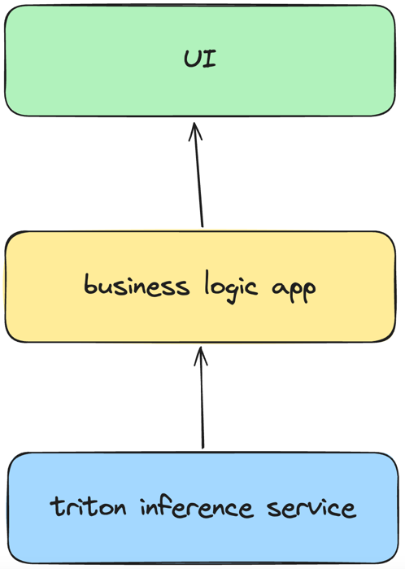

### 项目整体流程

triton inference service：triton 服务作为推理后端，只需要配置相应的模型以及模型的配置即可启动一个推理服务

business logic app：业务逻辑后端主要用于获取 triton 推理的结果，并对结果进行基本的处理，可根据实际业务需求对其进行定制化开发

UI：前端 UI 用于展示后端业务处理后的内容结果

当前项目基于 yolov8 实现了一个目标检测的简单 demo，旨在将整个流程串通，用户可以根据实际业务需求进行各个模块的定制化开发

当前 demo 效果如下

<video width="640" height="480" controls>
  <source src="doc/images/demo.mp4" type="video/mp4">
  Your browser does not support the video tag.
</video>

